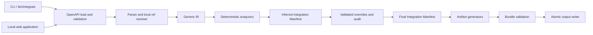

# Карта модулей HackGenesis Provider Integration Generator

Этот документ отвечает на два практических вопроса: где искать поведение конкретного этапа pipeline и какие соседние модули нужно изменить, чтобы расширение осталось универсальным. Краткий маршрут проверки результата находится в [JURY_GUIDE.md](JURY_GUIDE.md), запуск — в [README.md](README.md).

## Главный поток данных

Есть и второй, намеренно короткий путь: `generate --manifest` начинает работу с уже готового final manifest и идёт сразу в `ArtifactBundle`. Он нужен не как обход анализатора, а как проверяемая граница: service, docs, fixtures и compatibility report не читают OpenAPI и override-файл.

## Правила зависимостей

1. `openapi/` извлекает структуру, но не назначает payout-intents и не знает конкретных провайдеров.
2. `ir/` — provider-neutral контракт между parser и semantic analysis.
3. `analyzer/` читает Generic IR и строит inferred manifest. Эвристика всегда возвращает confidence/evidence и не должна скрывать неоднозначность.
4. `overrides/` меняет только разрешённые части inferred manifest, проверяет ссылки и сохраняет before/after audit.
5. `provider_ir/` задаёт исполняемый контракт для последующих слоёв. Невалидный prebuilt manifest не должен дойти до генерации.
6. `generator/` читает только final manifest. Доступ к исходному YAML/JSON из генератора нарушает архитектурную границу.
7. `OutputWriter` отвечает за публикацию, а не за смысл интеграции: он проверяет имена, записывает staging-каталог, запускает внешний `ruby -c` и только затем делает каталог итоговым.
8. Web UI не реализует второй pipeline. Он вызывает те же Ruby parser, analyzers, overrides и generators, что CLI.

## Точки входа и оркестрация

| Модуль | Ответственность | Вход → выход | Основные зависимости | Проверка |
|---|---|---|---|---|
| [`bin/integrate`](bin/integrate) | Безопасный bootstrap CLI, в том числе из Windows-пути с кириллицей | аргументы процесса → exit code | `IntegrationGenerator::CLI` | [`entrypoints_test.rb`](test/entrypoints_test.rb), [`cli_test.rb`](test/cli_test.rb) |
| [`IntegrationGenerator::CLI`](lib/integration_generator/cli.rb) | Команды `inspect`, `analyze`, `generate`; выбор полного или manifest-only пути | путь OpenAPI/manifest/override → stdout или output-каталог | parser, manifest builder/loader, overrides, bundle, writer | [`cli_test.rb`](test/cli_test.rb) |
| [`bin/demo`](bin/demo) | Один воспроизводимый прогон трёх demo-specs, review transition и проверка пяти файлов | необязательный новый output root → три bundle | публичный CLI | [`demo_test.rb`](test/demo_test.rb) |
| [`bin/serve`](bin/serve) | Bootstrap локального интерфейса на `127.0.0.1` | port → WEBrick server | `Web::Server` | [`entrypoints_test.rb`](test/entrypoints_test.rb), [`server_test.rb`](test/web/server_test.rb) |
| [`errors.rb`](lib/integration_generator/errors.rb) | Единый предметный формат `code/message/location` | причина ошибки → форматированное сообщение | нет доменных зависимостей | negative tests parser/CLI/generator |

## OpenAPI и Generic IR

| Модуль | Ответственность | Вход → выход | Что намеренно не делает | Основная проверка |
|---|---|---|---|---|
| [`OpenAPI::Loader`](lib/integration_generator/openapi/loader.rb) | Читает UTF-8 YAML/JSON, использует safe YAML load, отклоняет неверное расширение и циклические aliases | файл → Hash со строковыми ключами | не проверяет OpenAPI-семантику | [`loader_test.rb`](test/openapi/loader_test.rb) |
| [`DocumentValidator`](lib/integration_generator/openapi/document_validator.rb) | Проверяет корень, OpenAPI 3.x, обязательные `info` и `paths` | сырой Hash → проверенный Hash | не валидирует весь стандарт | [`document_validator_test.rb`](test/openapi/document_validator_test.rb) |
| [`RefResolver`](lib/integration_generator/openapi/ref_resolver.rb) | Раскрывает local JSON Pointer `$ref`, учитывает sibling fields, ловит missing/external/cyclic refs | Hash → resolved Hash | не загружает remote refs | [`ref_resolver_test.rb`](test/openapi/ref_resolver_test.rb) |
| [`SchemaParser`](lib/integration_generator/openapi/schema_parser.rb) | Нормализует object/array/scalars, required, enum, format, constraints, nullable, readOnly/writeOnly и `additionalProperties` | OpenAPI schema → `IR::Schema` | не исполняет полный JSON Schema validator | [`schema_parser_test.rb`](test/openapi/schema_parser_test.rb) |
| [`OpenAPI::Parser`](lib/integration_generator/openapi/parser.rb) | Собирает servers, security, operations, parameters, bodies, responses, headers, examples и warnings | resolved OpenAPI → `IR::Document` | не классифицирует payout-capabilities | [`parser_test.rb`](test/openapi/parser_test.rb) |
| [`IR::Document`](lib/integration_generator/ir/document.rb), [`Operation`](lib/integration_generator/ir/operation.rb), [`Schema`](lib/integration_generator/ir/schema.rb), [`Warning`](lib/integration_generator/ir/warning.rb) | Простые сериализуемые provider-neutral модели | нормализованные атрибуты → `to_h` | не содержат правил inference | parser и analyzer tests |

Generic IR сохраняет факты входа даже тогда, когда следующий слой ещё не умеет исполнить конструкцию. Для неподдерживаемых schema/auth/callback elements parser добавляет warning; broken refs и невалидная структура завершают команду ошибкой.

## Semantic analysis

[`Analyzer::ManifestBuilder`](lib/integration_generator/analyzer/manifest_builder.rb) — композиционный корень слоя. Он запускает независимые analyzers, объединяет их warnings и создаёт `ProviderIR::Manifest`.

| Модуль | Что решает | Вход → выход | Ключевой тест |
|---|---|---|---|
| [`Support`](lib/integration_generator/analyzer/support.rb) | Общий обход schemas, выбор JSON media, токенизация и direction-aware поля | Generic IR fragments → нормализованные entries | используется всеми analyzer tests |
| [`OperationClassifier`](lib/integration_generator/analyzer/operation_classifier.rb) | Оценивает `create_payout`, `fetch_status`, `cancel_payout`, `webhook`, `balance` по методу, пути, тексту и полям | operation → intent, confidence, evidence, alternatives, decision | [`operation_classifier_test.rb`](test/analyzer/operation_classifier_test.rb) |
| [`CapabilityResolver`](lib/integration_generator/analyzer/capability_resolver.rb) | Выбирает по одной операции на capability либо оставляет `missing`/`requires_review` | classified operations → capabilities и unsupported operations | classifier/manifest tests |
| [`AuthAnalyzer`](lib/integration_generator/analyzer/auth_analyzer.rb) | Нормализует API key, Bearer/Basic, root/per-operation AND/OR requirements и ENV placeholders | security schemes/requirements → auth section | [`review_contracts_test.rb`](test/analyzer/review_contracts_test.rb), runtime auth tests |
| [`StatusAnalyzer`](lib/integration_generator/analyzer/status_analyzer.rb) | Находит lifecycle enum только в success responses/callback и формирует reviewable status suggestions | operations/capabilities → status mapping | manifest/review contract tests |
| [`ErrorAnalyzer`](lib/integration_generator/analyzer/error_analyzer.rb) | Извлекает HTTP error definitions, вложенные code/message paths, headers и раздельные schema/example codes | responses → errors section | manifest и [`runtime_review_test.rb`](test/generator/runtime_review_test.rb) |
| [`WebhookAnalyzer`](lib/integration_generator/analyzer/webhook_analyzer.rb) | Находит обычный webhook POST, signature header/algorithm/encoding и payload paths/events | webhook operation → webhook section и warnings | manifest, review regressions, callback contract tests |
| [`FieldMappingAnalyzer`](lib/integration_generator/analyzer/field_mapping_analyzer.rb) | Предлагает host→provider request mappings, response id/status paths, amount transform и conditional requirements | operations/capabilities → field mappings/transformations | [`field_mapping_analyzer_test.rb`](test/analyzer/field_mapping_analyzer_test.rb), [`review_contracts_test.rb`](test/analyzer/review_contracts_test.rb) |

Порог classifier сейчас зафиксирован в правилах: confidence `>= 0.8` принимается, `0.5..0.79` требует review, ниже `0.5` операция остаётся unsupported. Confidence — результат системы баллов, а не статистическая вероятность корректной production-интеграции.

## Manifest и overrides

| Модуль | Ответственность | Вход → выход | Основная проверка |
|---|---|---|---|
| [`ProviderIR::Operation`](lib/integration_generator/provider_ir/operation.rb) | Валидирует intent и хранит operation contract/classification | attributes → immutable-style serializable operation | manifest builder tests |
| [`ProviderIR::Manifest`](lib/integration_generator/provider_ir/manifest.rb) | Проверяет обязательные sections, типы, capabilities→operations, auth references/requirements, webhook shapes и override audit | manifest Hash → validated manifest | [`runtime_validation_test.rb`](test/provider_ir/runtime_validation_test.rb) |
| [`ManifestLoader`](lib/integration_generator/provider_ir/manifest_loader.rb) | Безопасно читает prebuilt YAML/JSON manifest и переводит malformed shapes в `MANIFEST_*` errors | файл → `ProviderIR::Manifest` | runtime validation и CLI manifest tests |
| [`Overrides::Loader`](lib/integration_generator/overrides/loader.rb) | Безопасно читает versioned YAML/JSON override | файл → override Hash | [`applier_test.rb`](test/overrides/applier_test.rb) |
| [`Overrides::Applier`](lib/integration_generator/overrides/applier.rb) | Строго проверяет targets/values, применяет intent/status/field/amount/condition/webhook changes, пересчитывает зависимости и сохраняет audit | inferred manifest + override → final manifest | [`applier_test.rb`](test/overrides/applier_test.rb), generator regressions |

Override подтверждает решение, но не подменяет структурный контракт произвольными данными. Например, новый request mapping можно добавить только к существующему schema path; warning снимается только точным `code + location`, связанным с реальным изменением.

## Генерация и публикация

| Модуль | Артефакт или обязанность | Важные свойства | Основная проверка |
|---|---|---|---|
| [`Generator::Support`](lib/integration_generator/generator/support.rb) | Общие lookup, schema fixtures, examples и Markdown escaping | одинаковое понимание manifest у генераторов | artifact tests |
| [`ServiceGenerator`](lib/integration_generator/generator/service_generator.rb) | `<provider>_service.rb` | BaseService-style API, provider client boundary, auth, projection, amount/status/error/callback runtime | [`generated_service_contract_test.rb`](test/generator/generated_service_contract_test.rb), [`runtime_review_test.rb`](test/generator/runtime_review_test.rb), [`alt_withdrawal_service_contract_test.rb`](test/generator/alt_withdrawal_service_contract_test.rb) |
| [`DocumentationGenerator`](lib/integration_generator/generator/documentation_generator.rb) | `INTEGRATION.md` | setup, auth, capabilities, mappings, transformations, errors, callbacks, manual steps | [`artifact_bundle_test.rb`](test/generator/artifact_bundle_test.rb) и ручная сверка final bundle |
| [`FixturesGenerator`](lib/integration_generator/generator/fixtures_generator.rb) | `fixtures.json` | OpenAPI examples first, schema-generated provenance, expected mappings, unavailable capabilities | artifact and regression tests |
| [`CompatibilityGenerator`](lib/integration_generator/generator/compatibility_generator.rb) | `compatibility_report.md` | `READY`/`NEEDS REVIEW`/`UNSUPPORTED` без искусственного score | [`compatibility_generator_test.rb`](test/generator/compatibility_generator_test.rb) |
| [`ArtifactBundle`](lib/integration_generator/generator/artifact_bundle.rb) | Собирает пять файлов и валидирует их в памяти | manifest-only input, deterministic output, Ruby compile/JSON/YAML checks | [`artifact_bundle_test.rb`](test/generator/artifact_bundle_test.rb) |
| [`OutputWriter`](lib/integration_generator/generator/output_writer.rb) | Безопасно публикует новый каталог | lock, staging, safe filenames, no overwrite, внешний `ruby -c`, cleanup при ошибке | [`output_writer_test.rb`](test/generator/output_writer_test.rb) |

Generated service отделяет три разных обязанности. `build_request` строит transport-neutral request, `dispatch` вызывает переданный `provider_client`, `normalize_response` возвращает host-friendly facts. Сохранение provider operation id, retry/block/alert policy и реальный HTTP transport остаются у host-приложения.

Callback тоже имеет два явно разных входа. `process_callback(payload)` принимает parsed Hash и помечает результат `signature_verification: :host_required`. `process_verified_callback(raw_body, headers:)` проверяет HMAC на исходных байтах и затем разбирает именно подписанное тело.

## Локальный web-слой

| Модуль | Ответственность | Граница | Проверка |
|---|---|---|---|
| [`Web::Application`](lib/integration_generator/web/application.rb) | Каталог demo-specs, analyze/generate, новый output, safe archive/download | вызывает canonical Ruby pipeline; не читает произвольные download paths | [`application_test.rb`](test/web/application_test.rb) |
| [`Web::Server`](lib/integration_generator/web/server.rb) | WEBrick routing, JSON, Host/Origin/content-type guards, static allowlist | только `127.0.0.1`, локальный однопользовательский инструмент | [`server_test.rb`](test/web/server_test.rb) |
| [`web/app.js`](web/app.js), [`index.html`](web/index.html), [`app.css`](web/app.css) | Review workspace и preview/download пяти файлов | отображение; доменные решения принимает backend | [`frontend_test.js`](test/web/frontend_test.js) |

## Как расширять систему

### Поддержать ещё одну структурную часть OpenAPI

1. Добавить извлечение в `OpenAPI::Parser` или `SchemaParser` и сохранить факт в Generic IR.
2. Для неподдержанного варианта сначала добавить явный warning/error; не сужать его молча до знакомой формы.
3. Закрепить behavior в `test/openapi/` на canonical и минимальной альтернативной fixture.
4. Только затем использовать новый факт в analyzer. Генератор не должен читать исходную спецификацию.

### Добавить или скорректировать semantic rule

1. Выбрать один analyzer по предмету; общие обходы вынести в `Analyzer::Support`.
2. Вернуть evidence, confidence/provenance и безопасный review state.
3. Добавить positive, ambiguous и false-positive cases. Provider name/path из одного примера не должен становиться общей веткой.
4. Если решение может зависеть от интегратора, добавить общий override вместо provider-specific condition.

### Расширить override-контракт

Изменение проходит через `Overrides::Applier`, validation final manifest и потребителя в generator/runtime. Нужны проверки неизвестного key/value/target, before/after audit и невозможности снять несвязанный warning. Версию override следует менять при несовместимом контракте.

### Добавить новую capability

Это согласованное доменное изменение, а не одна константа. Нужно обновить intents/classifier, `CapabilityResolver`, `ProviderIR::Operation` и `Manifest`, профильные analyzers/mappings, service/docs/fixtures/compatibility generators, UI и canonical/alternative contract tests. Если новый endpoint не входит в `Provider::BaseService`, безопаснее оставить его в `unsupported_operations`, чем автоматически создавать публичный метод.

### Добавить новый generated artifact

Generator получает только final manifest и регистрируется в `ArtifactBundle`. Затем добавляются in-memory validation, publication/download allowlist, deterministic test и документация о назначении файла. `OutputWriter` не должен знать его доменную семантику.

## Где проверять изменение

| Изменённый слой | Минимальный набор | Когда нужен более широкий прогон |
|---|---|---|
| Loader/parser/schema/IR | соответствующий `test/openapi/*_test.rb` | если меняется serialized IR — analyzer и canonical pipeline |
| Analyzer/manifest/override | профильный analyzer test + manifest/override tests | если меняются executable mappings — generated runtime на canonical и alternative spec |
| Service generator/runtime | generated contract + runtime review + alternative withdrawal contract | всегда `ruby -c` полного bundle |
| Docs/fixtures/report | artifact bundle + compatibility tests, ручное чтение fresh artifacts | если изменён manifest contract — все generators |
| Output writer/CLI/web | профильные negative tests | для пользовательского flow — `bin/demo`; для UI — настоящий local HTTP/download smoke |

Полный порядок после существенного изменения остаётся таким: unit tests → canonical integration/golden → alternative specs → полный набор артефактов → `ruby -c` → generated RSpec, если он появится. Текущий проект генерирует fixtures, но не генерирует отдельный RSpec-файл.
